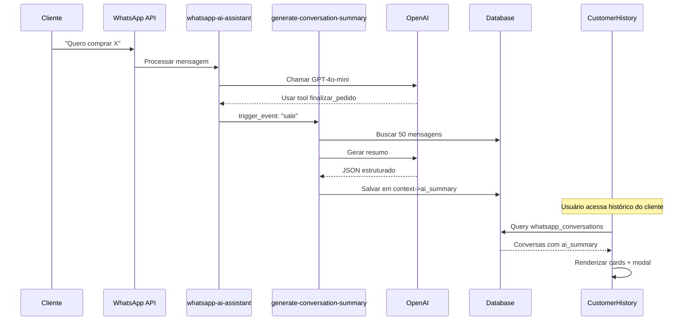

# 🚀 IMPLEMENTAÇÃO: RESUMOS IA + HISTÓRICO WHATSAPP

## ✅ ARQUIVOS CRIADOS/MODIFICADOS

### 📁 **1. Edge Function: generate-conversation-summary**
**Arquivo:** `supabase/functions/generate-conversation-summary/index.ts`
**Status:** ✅ CRIADO

**Funcionalidade:**
- Busca últimas 50 mensagens da conversa
- Chama GPT-4o-mini com prompt otimizado
- Gera resumo estruturado em JSON
- Salva em `whatsapp_conversations.context->ai_summary`

**Estrutura do resumo gerado:**
```json
{
  "ai_summary": {
    "generated_at": "2025-11-29T14:30:00Z",
    "trigger_event": "sale" | "appointment" | "transfer" | "inactive",
    "conversation_outcome": "venda_realizada" | "agendamento_criado" | "duvida_respondida" | "transferido_humano" | "sem_conclusao",
    "summary": "Resumo em 1-2 frases",
    "key_actions": ["Ação 1", "Ação 2"],
    "customer_needs": ["Necessidade 1"],
    "pending_actions": "O que está pendente",
    "next_steps": "Próxima ação recomendada",
    "message_count": 15
  }
}
```

---

### 📁 **2. whatsapp-ai-assistant/index.ts**
**Status:** ✅ MODIFICADO

**Mudanças:**
- Após `finalizar_pedido`: Chama generate-conversation-summary com `trigger_event: "sale"`
- Após `transferir_atendente`: Chama generate-conversation-summary com `trigger_event: "transfer"`
- Chamadas assíncronas (não bloqueiam resposta ao cliente)

---

### 📁 **3. CustomerHistory.tsx**
**Status:** ✅ MODIFICADO

**Mudanças:**
1. **Imports adicionados:**
   - `MessageCircle` (ícone WhatsApp)
   - `Dialog, DialogContent, DialogHeader, DialogTitle`
   - `useNavigate` (redirecionamento)

2. **Query expandida:**
   - Busca `whatsapp_conversations` com `ai_summary` não nulo
   - Filtra por `customer_id`
   - Ordena por `last_message_at`

3. **Interface HistoryEvent:**
   - Adicionado tipo `"whatsapp"`

4. **Filtros:**
   - Adicionado filtro "💬 WhatsApp"
   - Card contador no Resumo de Atividades

5. **Status badges:**
   - `active`: Verde
   - `waiting_human`: Amarelo
   - `closed`: Cinza
   - `resolved`: Azul

6. **Modal de Detalhes:**
   - Resumo completo
   - Ações tomadas (timeline)
   - Necessidades do cliente
   - Pendências (fundo amarelo)
   - Próximos passos (fundo azul)
   - Botão "Ver Conversa Completa" → `/conversas-whatsapp`

---

### 📁 **4. Migration**
**Arquivo:** `supabase/migrations/20251129000000_add_whatsapp_to_history.sql`
**Status:** ✅ CRIADO

**Conteúdo:**
- Validação que campo `context` existe
- Comentário JSONB com estrutura do `ai_summary`
- **NENHUMA alteração no schema** (campo já existe)

---

## 🔧 INSTRUÇÕES DE DEPLOY

### **PASSO 1: Deploy da Migration**
```bash
# No terminal do Supabase Dashboard ou CLI
supabase db push

# Ou copie o conteúdo de:
# supabase/migrations/20251129000000_add_whatsapp_to_history.sql
# E execute no SQL Editor do Supabase Dashboard
```

---

### **PASSO 2: Deploy da Edge Function**
```bash
# Via Supabase CLI
supabase functions deploy generate-conversation-summary

# OU manualmente no Dashboard:
# 1. Vá em Edge Functions
# 2. Crie nova function: "generate-conversation-summary"
# 3. Copie o código de: supabase/functions/generate-conversation-summary/index.ts
# 4. Deploy
```

---

### **PASSO 3: Verificar Variáveis de Ambiente**
Certifique-se que estas variáveis estão configuradas no Supabase:
```bash
OPENAI_API_KEY=sk-...  # Sua chave OpenAI
SUPABASE_URL=https://...
SUPABASE_SERVICE_ROLE_KEY=eyJhbGc...
```

---

### **PASSO 4: Redeploy whatsapp-ai-assistant**
```bash
# Deploy da função modificada
supabase functions deploy whatsapp-ai-assistant
```

---

## 🧪 COMO TESTAR

### **Teste 1: Venda Concluída**
1. Envie mensagem WhatsApp para o bot
2. Peça um produto: "Quero comprar X"
3. Bot adiciona ao carrinho
4. Forneça endereço e finalize pedido
5. ✅ Resumo gerado automaticamente

**Verificar:**
```sql
SELECT 
  id, 
  whatsapp_name,
  status,
  context->'ai_summary'->'summary' as resumo,
  context->'ai_summary'->'trigger_event' as evento
FROM whatsapp_conversations
WHERE customer_id = 'UUID_DO_CLIENTE'
  AND context->'ai_summary' IS NOT NULL;
```

---

### **Teste 2: Transferência Humano**
1. Cliente pede: "Quero falar com atendente"
2. IA chama `transferir_atendente`
3. ✅ Resumo gerado com contexto para humano

---

### **Teste 3: Ver no Histórico do Cliente**
1. Vá em **Clientes** → Selecione cliente
2. Clique em "Ver Histórico"
3. Filtre por "💬 WhatsApp"
4. ✅ Veja card com resumo
5. Clique em "Ver Detalhes"
6. ✅ Modal mostra resumo estruturado completo

---

## 📊 FLUXO COMPLETO



---

## 🎯 EVENTOS QUE GERAM RESUMO

| Evento | Trigger Event | Quando Ocorre |
|--------|--------------|---------------|
| 💰 **Venda Concluída** | `"sale"` | Após `finalizar_pedido` executado |
| 👤 **Transferência Humano** | `"transfer"` | Após `transferir_atendente` executado |
| 📅 **Agendamento** | `"appointment"` | Após `agendar_visita` (TAREFA 2C futura) |
| ⏰ **Inatividade 24h** | `"inactive"` | Cron job futuro (opcional) |

---

## 📝 PRÓXIMAS TAREFAS

### **TAREFA 2C: Tool agendar_visita**
Quando implementar, adicione após executar:
```typescript
// Em whatsapp-ai-assistant após agendar_visita
fetch(summaryUrl, {
  body: JSON.stringify({
    conversation_id: conversationId,
    trigger_event: "appointment",  // ← Novo evento
  }),
});
```

### **Cron Job Inatividade (Opcional)**
Criar Edge Function `summarize-inactive-conversations`:
```sql
-- Buscar conversas ativas sem mensagem há 24h
SELECT id 
FROM whatsapp_conversations
WHERE status = 'active'
  AND last_message_at < NOW() - INTERVAL '24 hours'
  AND context->'ai_summary' IS NULL;
```

---

## ✅ CHECKLIST DE VALIDAÇÃO

- [ ] Migration executada sem erros
- [ ] Edge Function `generate-conversation-summary` deployada
- [ ] Edge Function `whatsapp-ai-assistant` redeployada
- [ ] Variáveis de ambiente configuradas (OPENAI_API_KEY)
- [ ] Teste: Venda gera resumo automaticamente
- [ ] Teste: Transferência humano gera resumo
- [ ] Teste: Resumo aparece em CustomerHistory
- [ ] Teste: Modal de detalhes mostra estrutura completa
- [ ] Teste: Botão "Ver Conversa Completa" redireciona

---

## 🐛 TROUBLESHOOTING

### **Erro: OPENAI_API_KEY not configured**
✅ Configure no Supabase Dashboard → Settings → Edge Functions → Secrets

### **Resumo não aparece no histórico**
✅ Verifique query:
```sql
SELECT context->'ai_summary' 
FROM whatsapp_conversations 
WHERE customer_id = 'UUID';
```

### **Modal não abre**
✅ Verifique imports do Dialog no CustomerHistory.tsx

### **Erro TypeScript em whatsapp-ai-assistant**
✅ IGNORE - Erros `Cannot find name 'Deno'` são normais (VS Code não reconhece, mas funciona no Deno runtime)

---

## 📞 SUPORTE

Se houver dúvidas durante deploy:
1. Verifique logs no Supabase Dashboard → Edge Functions → Logs
2. Teste chamada manual da function:
```bash
curl -X POST https://SEU_PROJETO.supabase.co/functions/v1/generate-conversation-summary \
  -H "Authorization: Bearer ANON_KEY" \
  -H "Content-Type: application/json" \
  -d '{"conversation_id":"UUID","trigger_event":"sale"}'
```

---

**IMPLEMENTAÇÃO COMPLETA! 🎉**
- ✅ Edge Function criada
- ✅ whatsapp-ai-assistant modificado
- ✅ CustomerHistory.tsx expandido
- ✅ Migration preparada
- ✅ Testes documentados
